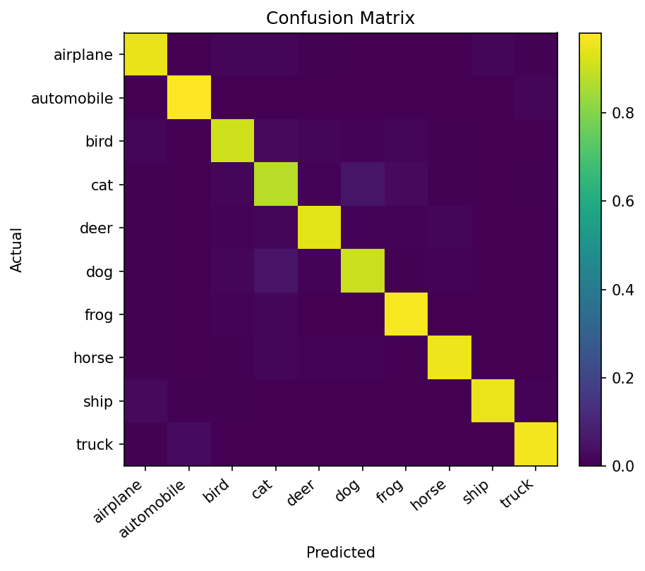
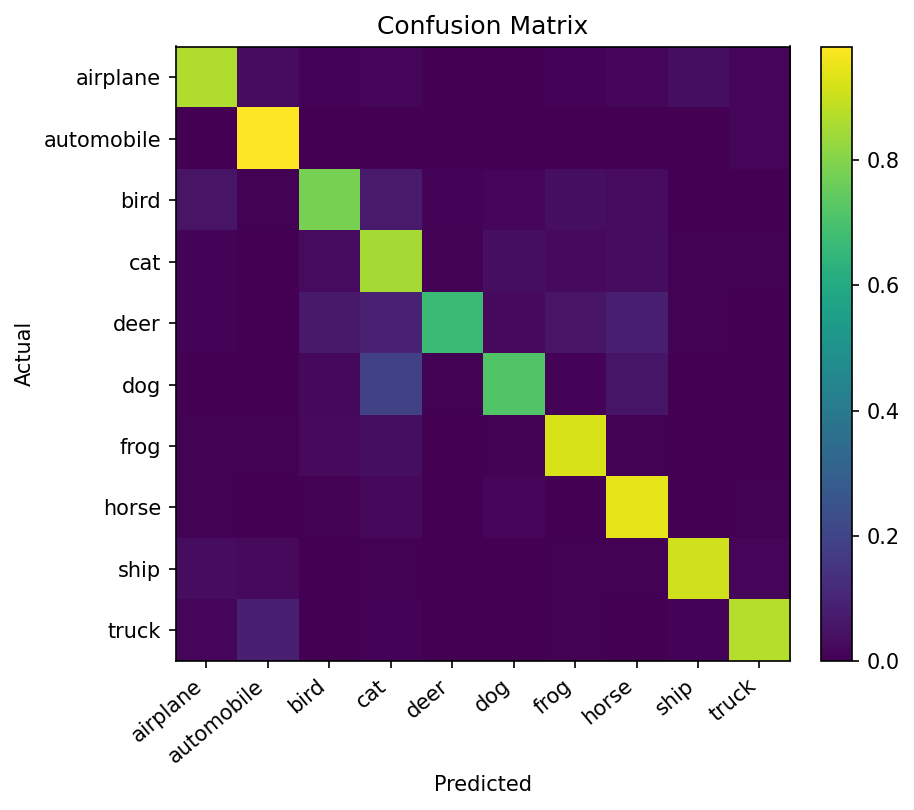

# CIFAR-10 Classification with CNNs (PyTorch)


A clean, reproducible **CIFAR‑10** training pipeline in PyTorch with:
- modular code (datasets, models, training, evaluation),
- K‑fold cross‑validation,
- cosine LR schedule with warmup & early stopping,
- simple grid search over hyper‑parameters,
- Docker (CUDA‑enabled) + Compose for one‑command runs.

> CIFAR‑10: 60,000 images (32×32 RGB) across 10 classes: airplane, automobile, bird, cat, deer, dog, frog, horse, ship, truck.

---

## 📊 Results

| Model        | Test Accuracy | Params (M) | Notes                  |
|--------------|--------------|------------|------------------------|
| SimpleCNN    | 89.87%       | 1.2M       | Lightweight baseline   |
| ResNet-18    | 94.0%        | 11.2M      | Best performing model  |
| WRN-28-10    | -            | -          | Not run (resource limit)|

### Confusion Matrices
- ResNet-18

- SimpleCNN

---

## Installation

*Recommended: Create a virtual environment for this project.*

**Requirements:**
- Python version (3.9+)
- CUDA version (12.1)
- PyTorch version (2.2.x tested)

### 1) Environment (pip)
```bash
# 1) Clone
git clone https://github.com/pipoiwoczz/CIFAR-10-Classification-CNNs.git
cd CIFAR-10-Classification-CNNs

# 2) Create env
python -m venv .venv && source .venv/bin/activate  # (Windows) .venv\Scripts\activate

# 3) Install deps
pip install -r requirements.txt
```

### 2) Train a model
```bash
python train.py  --final --models resnet18   --epochs 60   --batch-size 512   --base-lr 5e-3   --weight-decay 5e-4   --dropout 0.3   --label-smoothing 0.1    --save-dir outputs/resnet18
```
Key flags (common):  
`--models [simple_cnn,resnet18,resnet34,densenet121,...]` · `--epochs` · `--batch-size` · `--base-lr` · `--weight-decay` · `--dropout` · `--label-smoothing` · `--save-dir` · `--device {cpu,cuda}`
`--final or --cv`: Choose whether to run a final training or cross-validation.

You can also train multiple models at once by passing a space-separated list to `--models`.
Example:
```bash
python train.py  --final --models resnet18 simple_cnn   --epochs 60   --batch-size 512   --base-lr 5e-3   --weight-decay 5e-4   --dropout 0.3   --label-smoothing 0.1    --save-dir outputs/
```

### 3) Evaluate a checkpoint
```bash
python evaluate.py 
```
Evaluate trained models. Change the `model` save path and `model architecture` in the script as needed.

---

## 🧩 Project structure

```
📂 CIFAR-10-Classification-CNNs
├── 📂 data/ # CIFAR-10 dataset (auto-downloaded here)
├── 📂 grid_search_results/ # CSV + JSON results from grid search
├── 📂 runs/ # Training runs, checkpoints, logs
├── 📂 src/
│ ├── 📂 pycache/
│ ├── ⚙️ config.py # Global config (hyper-params, paths, seeds)
│ ├── 📄 cv.py # K-fold cross-validation training loop
│ ├── 📄 data.py # Dataset, transforms, DataLoader helpers
│ ├── 📄 model.py # Model builders (SimpleCNN, ResNet-CIFAR, WRN-28-10)
│ └── 📄 utils.py # Utilities (schedulers, early stopping, seed utils)
├── 📂 trained_model/ # Saved model checkpoints (.pt files)
├── 📂 venv/ # Virtual environment (local)
├── ⚙️ .gitattributes
├── ⚙️ .gitignore
├── ⚙️ docker-compose.yml
├── ⚙️ Dockerfile
├── 📄 evaluate.py # Load checkpoint & evaluate on test set
├── 📄 grid_search.py # Hyper-parameter grid search runner
├── 📜 LICENSE
├── 📝 README.md
├── 📄 requirements.txt
└── 📄 train.py # Train one or more models (CV or final split)
```

---

## 📦 Docker & Compose

> Requires **NVIDIA Container Toolkit**.

**Build & run (single training):**
```bash
# Build image
docker build -t cifar10-cnn .

# Train with GPU (mount outputs)
docker run --gpus all --rm -it   -v $(pwd)/outputs:/app/outputs   -v $(pwd)/reports:/app/reports   cifar10-cnn   python train.py --final --model resnet18 --epochs 60 --batch-size 512
```

**docker-compose.yml** (example):
```yaml
services:
  train:
    image: cifar10-cnn
    build: .
    command: >
      python train.py --model resnet18 --epochs 60
    deploy:
      resources:
        reservations:
          devices:
            - capabilities: [gpu]
    volumes:
      - ./outputs:/app/outputs
      - ./reports:/app/reports
```

Run:
```bash
docker compose up --build train
```

---

## 🔎 Grid search

Try multiple hyper‑parameter combinations (runs CV under the hood):
```bash
python grid_search.py
```
Change the hyperparameters in the script as needed. Key changes can be made to the following variables:
- `models`: List of model names to train (e.g., `["resnet18", "simple_cnn"]`).
- `lrs`: Learning rates to try (e.g., `[0.001, 0.0001]`).
- `dropouts`: Dropout rates to try (e.g., `[0.3, 0.5]`).
- `label_smoothing`: Label smoothing values to try (e.g., `[0.0, 0.1]`).
- `weight_decays`: Weight decay values to try (e.g., `[0.0001, 0.0005]`).
- `batch_sizes`: Batch sizes to try (e.g., `[256, 512]`).
- `epochs`: Number of epochs to train (e.g., `60`).
- `n_splits`: Number of cross-validation splits (e.g., `3`).
- `save_dir`: Output CSV file path (e.g., `results/grid.csv`).

> You can also modify the training script to log additional metrics or change the evaluation strategy.

**Sample results (from a past run):**
| base_lr | weight_decay | dropout | label_smoothing | batch_size | epochs | n_splits | val_mean | val_std | fold_accs                     | time_min |
|---------|--------------|---------|-----------------|------------|--------|----------|----------|---------|-------------------------------|----------|
| 0.005   | 0.0003       | 0.3     | 0.1             | 256        | 120    | 3        | 0.6684   | 0.0274  | [0.6332, 0.6720, 0.7000]     | 7.83     |
| 0.005   | 0.0003       | 0.5     | 0.1             | 256        | 120    | 3        | 0.6793   | 0.0169  | [0.6936, 0.6556, 0.6888]     | 17.68    |
| 0.005   | 0.0010       | 0.3     | 0.1             | 256        | 120    | 3        | 0.6747   | 0.0247  | [0.6468, 0.6704, 0.7068]     | 25.92    |
| 0.005   | 0.0010       | 0.5     | 0.1             | 256        | 120    | 3        | 0.6612   | 0.0269  | [0.6796, 0.6808, 0.6232]     | 34.03    |
| 0.01    | 0.0003       | 0.3     | 0.1             | 256        | 120    | 3        | 0.6287   | 0.0186  | [0.6208, 0.6108, 0.6544]     | 37.93    |
| 0.01    | 0.0003       | 0.5     | 0.1             | 256        | 120    | 3        | 0.6513   | 0.0391  | [0.6152, 0.6332, 0.7056]     | 43.36    |
| 0.01    | 0.0010       | 0.3     | 0.1             | 256        | 120    | 3        | 0.6595   | 0.0223  | [0.6892, 0.6356, 0.6536]     | 48.79    |
| 0.01    | 0.0010       | 0.5     | 0.1             | 256        | 120    | 3        | 0.6452   | 0.0176  | [0.6444, 0.6240, 0.6672]     | 54.13    |
| 0.05    | 0.0003       | 0.3     | 0.1             | 256        | 120    | 3        | 0.7249   | 0.0159  | [0.7308, 0.7032, 0.7408]     | 60.68    |
| 0.05    | 0.0003       | 0.5     | 0.1             | 256        | 120    | 3        | 0.7040   | 0.0145  | [0.6876, 0.7016, 0.7228]     | 67.24    |
| 0.05    | 0.0010       | 0.3     | 0.1             | 256        | 120    | 3        | 0.6768   | 0.0185  | [0.6728, 0.7012, 0.6564]     | 71.66    |
| 0.05    | 0.0010       | 0.5     | 0.1             | 256        | 120    | 3        | 0.7075   | 0.0312  | [0.7336, 0.6636, 0.7252]     | 78.11    |
| 0.1     | 0.0003       | 0.3     | 0.1             | 256        | 120    | 3        | 0.7372   | 0.0198  | [0.7108, 0.7584, 0.7424]     | 84.07    |
| 0.1     | 0.0003       | 0.5     | 0.1             | 256        | 120    | 3        | 0.7321   | 0.0486  | [0.7360, 0.7896, 0.6708]     | 92.92    |
| 0.1     | 0.0010       | 0.3     | 0.1             | 256        | 120    | 3        | 0.7343   | 0.0241  | [0.7268, 0.7668, 0.7092]     | 99.34    |
| 0.1     | 0.0010       | 0.5     | 0.1             | 256        | 120    | 3        | 0.6887   | 0.0307  | [0.6960, 0.6480, 0.7220]     | 104.29   |

---

## 🧠 Models

- **SimpleCNN**: a lightweight baseline CNN for CIFAR-10 (stacked 3×3 conv blocks, BN, ReLU, pooling, dropout).  
- **ResNet-CIFAR (ResNet-18 variant)**: adapted ResNet with 3×3 stem (no 7×7 or maxpool) for 32×32 images.  
- **WideResNet-28-10**: deeper and wider variant of ResNet, tuned for CIFAR-10 with adjustable drop rate.  (*Not used due to the lack of computing resources*)

Loss: CrossEntropy (optionally with label smoothing)  
Optimizer: AdamW / SGD  
Scheduler: CosineAnnealing with warmup

---

## ⚙️ Useful flags (common)

```
--data-root ./data/cifar10      # will auto-download if missing
--num-workers 0                 # DataLoader workers
--amp                           # enable mixed precision
--patience 10                   # early stopping
--warmup-epochs 5               # LR warmup
--grad-clip 1.0                 # clip norm
--seed 42
```

---

## 🏁 Reproducibility

We fix seeds and configure cuDNN determinism for fair comparisons. Exact determinism isn’t always guaranteed on GPU; we log all hyper‑params and seeds for each run.

---

## 📎 References

- [CIFAR‑10 dataset description (Krizhevsky, 2009)](https://www.cs.toronto.edu/~kriz/cifar.html).

---

## 📜 License

This project is released under the MIT License. See `LICENSE` for details.
